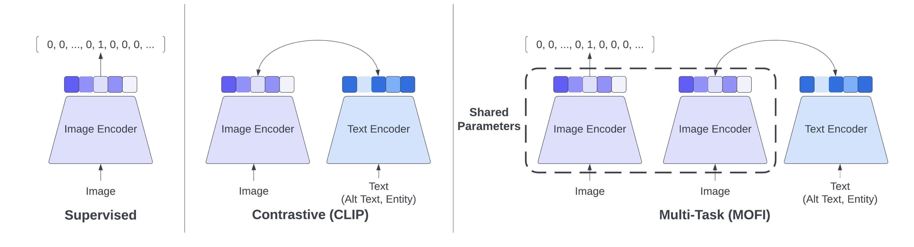

# MOFI

This software project accompanies the research paper, [MOFI: Learning Image Representations from Noisy Entity Annotated Images](https://arxiv.org/abs/2306.07952).

<p align="center">
    </a> <br>
    Diagram of MOFI.
</p>

## Abstract

We present MOFI, a new vision foundation model designed to learn image representations from noisy entity annotated images. MOFI differs from previous work in two key aspects: (i) pre-training data, and (ii) training recipe. Regarding data, we introduce a new approach to automatically assign entity labels to images from noisy image-text pairs. Our approach involves employing a named entity recognition model to extract entities from the alt-text, and then using a CLIP model to select the correct entities as labels of the paired image. The approach is simple, does not require costly human annotation, and can be readily scaled up to billions of image-text pairs mined from the web. Through this method, we have created Image-to-Entities (I2E), a new large-scale dataset with 1 billion images and 2 million distinct entities, covering rich visual concepts in the wild. Building upon the I2E dataset, we study different training recipes, including supervised pre-training, contrastive pre-training, and multi-task learning. For constrastive pre-training, we treat entity names as free-form text, and further enrich them with entity descriptions. Experiments show that supervised pre-training with large-scale fine-grained entity labels is highly effective for image retrieval tasks, and multi-task training further improves the performance. The final MOFI model achieves 86.66% mAP on the challenging GPR1200 dataset, surpassing the previous state-of-the-art performance of 72.19% from OpenAI's CLIP model. Further experiments on zero-shot and linear probe image classification also show that MOFI outperforms a CLIP model trained on the original image-text data, demonstrating the effectiveness of the I2E dataset in learning strong image representations.

## Documentation

`MOFI` has two parts - image encoder and text encoder. Each encoder produces an embedding vector, which can be used for computing similarity between image/image or image/text pairs.
In order to compute the similarity one should normalize the vectors and then compute a dot product between them. Higher dot product value corresponds to a higher similarity.

The following checkpoints are provided:

| model name | image params | text params |  GPR1200 | download |
| -----------| ------- | ------- | ---------| ------- |
| MOFI-B16   | 86M | 64M | 83.41%  | [mofi-b16-hf.zip](https://docs-assets.developer.apple.com/ml-research/models/mofi/mofi-b16-hf.zip) |
| MOFI-L14   | 303M | 124M | 86.14%  | [mofi-l14-hf.zip](https://docs-assets.developer.apple.com/ml-research/models/mofi/mofi-l14-hf.zip) |
| MOFI-H14   | 631M | 354M | 86.75%  | [mofi-h14-hf.zip](https://docs-assets.developer.apple.com/ml-research/models/mofi/mofi-h14-hf.zip) |

## Getting Started 

`MOFI` models can be loaded using `transformers` library. So in order to start one would need `transformers` library to be installed:

```pip install transformers```

### Import Libraries

```
from transformers import AutoTokenizer, AutoModel
import torch
from PIL import Image
import numpy as np
from torchvision import transforms
```

### Load Model

```
MODEL_DIR = 'mofi-h14-hf'
model = AutoModel.from_pretrained(MODEL_DIR)
```

### Download Images

For example, lets use the following images:


```
curl 'https://upload.wikimedia.org/wikipedia/commons/4/40/Pudel_Grossschwarz.jpg' -o poodle.jpg
curl 'https://upload.wikimedia.org/wikipedia/commons/f/f7/DOG-HUSKY_23JUL00.jpg' -o husky.jpg
curl 'https://upload.wikimedia.org/wikipedia/commons/b/bb/Kittyply_edit1.jpg' -o cat.jpg
```

### Load and Preprocess Images

```
transform = transforms.Compose([
    transforms.ToTensor(),
    transforms.Resize(224, antialias=False),
    transforms.CenterCrop(224),
    transforms.Normalize(
        mean=torch.tensor([0.48145466, 0.4578275, 0.40821073]),
        std=torch.tensor([0.26862954, 0.26130258, 0.27577711]),
    ),
])
def load_image(name):
    img_pil = Image.open(name)
    return transform(img_pil).unsqueeze(0)

imgs = torch.cat([load_image('poodle.jpg'), load_image('husky.jpg'), load_image('cat.jpg')], dim=0)
```

### Compute Image Embedding

```
images_emb = model.get_image_features(imgs)
images_emb /= images_emb.norm(dim=-1, keepdim=True)
```

### Load Text Tokenizer
Note, the tokenizer is based on `OPT` with custom `bos`, `eos` and `pad`.

```
tokenizer = AutoTokenizer.from_pretrained(MODEL_DIR)
```

### Compute Text Embedding

```
input_ids = tokenizer(
    ["a photo of a poodle", "a photo of a husky", "a photo of a cat"],
    return_tensors='pt', padding=True, return_attention_mask=False,
)['input_ids']
texts_emb = model.get_text_features(input_ids=input_ids)
texts_emb /= texts_emb.norm(dim=-1, keepdim=True)
```

### Compute Similarity Between Images

```
i2i = images_emb.matmul(images_emb.T)
```

| |  | | |
| --- | ---- | ---- | ---- |
|  | 1.0 | 0.2638 | 0.0819 |
|  | 0.2638 | 1.0 | 0.193 |
|  | 0.0819 | 0.193 | 1.0 |

### Compute Similarity Between Texts and Images
```
t2i = texts_emb.matmul(images_emb.T)
```

| |  | | |
| --- | ---- | ---- | ---- |
| a photo of a poodle | 0.2025 | 0.0717 | 0.0302 |
| a photo of a husky | 0.0517 | 0.2019 | 0.0645 |
| a photo of a cat | 0.0584 | 0.0958 | 0.1867 |

## Citation

If you find `MOFI` useful, please cite using this BibTeX:

```bibtex
@article{mofi2023,
  title={MOFI: Learning Image Representations from Noisy Entity Annotated Images},
  author={Wentao Wu, Aleksei Timofeev, Chen Chen, Bowen Zhang, Kun Duan, Shuangning Liu, Yantao Zheng, Jon Shlens, Xianzhi Du, Zhe Gan, Yinfei Yang},
  journal={arXiv preprint arXiv:2306.07952},
  year={2023}
}
```

## Acknowledgement

- [axlearn](https://github.com/apple/axlearn): the codebase we use to train the models. 
- [huggingface transformers](https://huggingface.co/docs/transformers/en/index): Transformers provides APIs to load our trained models.
